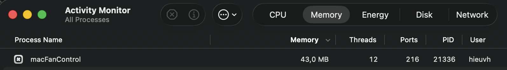

# macOS Fan Control Utility

A sleek, native SwiftUI macOS application designed for real-time monitoring and manual/automated control of MacBook fan speeds. Compatible exclusively with Apple Silicon (M1/M2/M3/M4/M5+) architectures (Intel processors are not supported).


It features a dual-component design: a sandboxed SwiftUI GUI front-end that communicates with a privileged command-line helper (`smc-helper`) to securely read and write System Management Controller (SMC) registers.

---

## 🚀 Key Features

*   **Real-Time Telemetry Grid**:
    *   Monitor actual fan speeds with a custom rotating vector fan blade animation that responds to changes in RPM.
    *   Dynamic sensor temperature monitoring for **CPU** (Orange), **GPU** (Indigo), and **Battery** (Green).
    *   Interactive **Swift Charts** temperature log history popup displaying statistical trends (current, average, min, and max temperatures).
*   **Auto-Trigger Rules Engine**:
    *   Set custom automated threshold rules for CPU, GPU, or Battery (e.g. *if CPU ≥ 75°C, override all fans to 80%*).
    *   Evaluates active rules in real-time, automatically prioritizing the highest safety speed.
    *   Instantly yields control back to macOS automatic management once the hardware cools down.
*   **Manual Override Presets**:
    *   Precise slider adjustments for custom target RPMs.
    *   One-click presets: **Auto**, **20%**, **50%**, **80%**, and **Max** buttons.
    *   Optimized single-write execution block to prevent race conditions during mode adjustments.
*   **Linked Fan Tuning**:
    *   Synchronize targets across all system fans simultaneously on dual-fan MacBook Pro models.
*   **Status Menu Bar Popover Utility**:
    *   Fully functional telemetry and control dashboard accessible from the system tray.
    *   Trigger administrative setups, apply manual presets, toggle link configurations, or launch the settings panel directly.
*   **Launch at Startup**:
    *   Built-in configuration toggle utilizing macOS native `SMAppService` API for login registrations.
*   **Ultra Performance, Memory & Battery Saving**:
    *   **Lazy Main Window**: Prevents initial `ContentView` instantiation at startup. Automatically deallocates the entire SwiftUI view tree, charts, and layout hierarchies when the main window is closed.
    *   **Two-Tier Data Model**: Maintains a compact in-memory ring buffer (5–10 values) for the menu bar telemetry while only allocating the full 60+ record history chart in memory when the window is visible.
    *   **Autoreleasepool Tick Boxing**: Wraps the background SMC reading ticks inside `autoreleasepool {}` to instantly release temporary allocation buffers without waiting for the system run loop.
    *   **Single Atomic `@Published` Snapshot**: Consolidated multi-property updates into a single `@Published var snapshot: FanSnapshot` to trigger exactly one SwiftUI diff pass instead of N separate updates per tick.
    *   **OS-level Agent (Dock Isolation)**: Set `LSUIElement` to `true` at the Info.plist level combined with `applicationShouldTerminateAfterLastWindowClosed` returning `false` to start purely in the menu bar without launching any initial blank window.
    *   **Dynamic Polling Loop**: Automatic interval adjustments (1.5s active interactive, 5.0s background active rules checking).
    *   **Draw Caching**: Pre-renders menu bar status icons to prevent expensive main-thread drawing allocations.
    *   **Timeline Animation Pausing**: Stops fan timelines completely when container windows or popovers are collapsed.
    *   **O(N) Traversal**: Computes statistical summaries in a single pass to eliminate chart hover latency.
    *   **SMC Caching**: Detects and caches active SMC sensor keys once on startup.



---

## 📂 Project Architecture & Code Structure

The codebase is organized into clean, single-responsibility files conforming to MVVM patterns:

-   📂 **`Core/`**: Core drivers (`SMC.swift`) managing raw AppleSMC register reads/writes and Apple Silicon unlocking sequences.
-   📂 **`Models/`**: Shared structs (`FanJSON.swift`) describing deserialized telemetry packages and auto-rules.
-   📂 **`ViewModels/`**: Orchestration logic (`FanViewModel.swift`) querying sensors, checking authorization, persisting rules, and evaluating automatic triggers.
-   📂 **`Views/`**: Reusable SwiftUI layout views.
    *   `AuthorizationRequiredCard.swift`: Reusable privilege authorization card.
    *   `CompactSensorCard.swift`: Glassmorphic sensor temperature display cards.
    *   `ContentView.swift`: Main window structure and tab navigation sidebar.
    *   `HeroFanDial.swift`: Interactive fan dial and quick preset controls.
    *   `MenuBarPopoverView.swift`: Status bar dropdown layout and controls.
    *   `OverviewTabView.swift`: Dashboard grids.
    *   `RulesEngineView.swift`: Advanced autotarget rules setup board.
    *   `SettingsTabView.swift`: Startup and link fans toggles.
    *   `SpinningFanView.swift`: Timeline animatable vector fan blade widget.
    *   `TempHistoryChartView.swift`: Single-pass O(N) temperature log graph.
-   📂 **`App/`**: Application Entry Scene (`FanControlApp.swift`) coordinating background agent lifecycle and system Menu Bar Extra tray access.
-   📂 **`Helper/`**: Privilege operations wrapper (`main.swift`) serving as a setuid execution client.

---

## 🛠️ Build and Compilation

Clone the repository and run the automated packaging script inside the project directory:

```bash
# Make the build script executable
chmod +x build.sh

# Compile and package the application bundle
./build.sh
```

This compiles `smc-helper` and `FanControl`, drafts the app metadata (`Info.plist`), and processes visual assets to output a standard application bundle: **`Fan Control.app`** and a compressed **`Fan Control.zip`** ready for distribution.

By default, the build script pins the app and helper binaries to macOS 13.0 and compiles for Apple Silicon (arm64) architectures. You can override those defaults:

```bash
MACOS_DEPLOYMENT_TARGET=14.0 ARCHS="arm64" ./build.sh
```

---

## 🚀 Installation & Security Setup

1.  **Launch the Application**:
    Open the application bundle in Finder or launch it from your terminal:

    ```bash
    open "Fan Control.app"
    ```

2.  **Configure Privilege Setup (Required Once)**:
    Writing custom values to the SMC requires administrative permission. On the first launch, follow these steps to configure access:
    *   Click the **"Authorize"** button in the main window or status bar popover card.
    *   Enter your macOS administrator password when prompted.

    *Alternatively, you can manually set the privileged helper permissions using the command line:*

    ```bash
    sudo chown root:wheel "Fan Control.app/Contents/MacOS/smc-helper"
    sudo chmod +s "Fan Control.app/Contents/MacOS/smc-helper"
    ```

---

## 📄 License

This project is open-source software licensed under the [MIT License](LICENSE).
